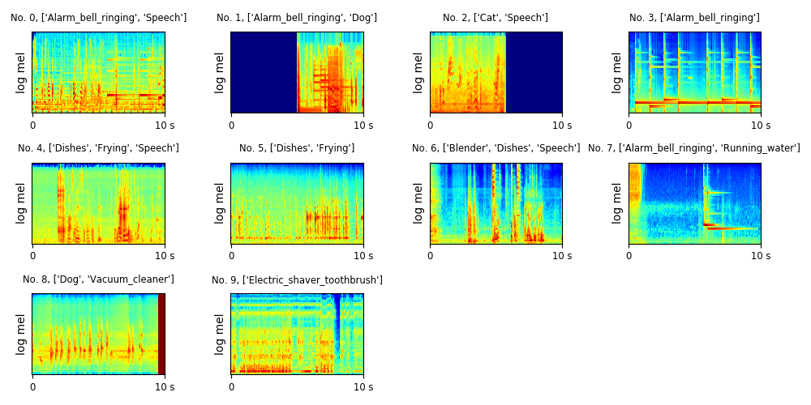

# DCASE 2018 Task 4 Large-scale weakly labeled semisupervised sound event detection in domestic environments

DCASE 2018 Task 4 is the large-scale detection of sound events using weakly labeled data. There are 10 sound classes including 'Speech', 'Frying', 'Vacuum_cleaner', etc. We provide a convolutional neural network (CNN) baseline system implemented with PyTorch in this code base. More details about this challenge can be found http://dcase.community/challenge2018/task-large-scale-weakly-labeled-semi-supervised-sound-event-detection

## DATASET

The dataset is downloadable from http://dcase.community/challenge2018/task-large-scale-weakly-labeled-semi-supervised-sound-event-detection

Each audio clip is around 10 second. 

The development data consists of 1578 weakly labeled audio clips, 14412 unlabel in domain audio clips, 39999 unlabeled out of domain audio clips and 288 audio clips with strong labels for development. The evaluation data consists of 880 audio clips. Each audio clip last for around 10 seconds. 

|                               | Number of audios |
|-------------------------------|------------------|
| Train (weak)                  | 1578             |
| Train (unlabel_in_domain)     | 14412            |
| Train (unlabel_out_of_domain) | 39999            |
| Test (strong)                 | 288              |
| Evalutation                   | 880              |

The log mel spectrogram of the scenes are shown below:

The audio names are:
<pre>
No. 0, YKK227gPpRn4_30.000_40.000.wav
No. 1, Y44U-fF5rsjM_0.000_10.000.wav
No. 2, Y0632OqvXrwg_7.000_17.000.wav
No. 3, Y-6p32k2WUCs_0.000_10.000.wav
No. 4, Y5_OJsj6bcuo_260.000_270.000.wav
No. 5, Y8EQHKEd5mm4_120.000_130.000.wav
No. 6, Yhtox2pJ-XVs_190.000_200.000.wav
No. 7, YmOfTDGOGBpI_160.000_170.000.wav
No. 8, Y0_J0BWiW7-k_12.000_22.000.wav
No. 9, Y7yeWLEus7OI_80.000_90.000.wav
</pre>

## Run the code
**1. (Optional) Install dependent packages.** If you are using conda, simply run:

$ conda env create -f environment.yml

$ conda activate py3_dcase2018_task4

**2. Then simply run:**

$ ./runme.sh

Or run the commands in runme.sh line by line, including: 

(1) Modify the paths of data and your workspace

(2) Extract features

(3) Train model

(4) Evaluation

We validate the average precision (AP) and area under the curve (AUC) during training. The training looks like:

<pre>
root        : INFO     Loading data time: 1.390 s
root        : INFO     Training audios: 1578
root        : INFO     Validation audios: 288
root        : INFO     iteration: 100, train time: 13.633 s, validate time: 1.027 s
root        : INFO     tr_ap: 0.652, tr_auc: 0.907, tr_loss: 0.256
root        : INFO     va_ap: 0.609, va_auc: 0.879, va_loss: 0.272
root        : INFO     
root        : INFO     iteration: 200, train time: 13.807 s, validate time: 1.045 s
root        : INFO     tr_ap: 0.828, tr_auc: 0.961, tr_loss: 0.180
root        : INFO     va_ap: 0.713, va_auc: 0.918, va_loss: 0.226
......
root        : INFO     iteration: 5000, train time: 15.669 s, validate time: 1.133 s
root        : INFO     tr_ap: 1.000, tr_auc: 1.000, tr_loss: 0.003
root        : INFO     va_ap: 0.781, va_auc: 0.930, va_loss: 0.260
</pre>

## Result

We apply a convolutional neural network on the log mel spectrogram feature to solve this task. Training takes around 100 ms / iteration on a GTX Titan X GPU. The model is trained for 5000 iterations. The result is shown below. We use mean average precision (mAP) to evaluate audio tagging (AT) and F score to evaluate sound event detection (SED). 

|                            | AT (mAP)  | SED_1 (F score) | SED_2 (F score) |
|----------------------------|-----------|-----------------|-----------------|
| Speech                     | 0.848     | 0.0%            | 15.1%           |
| Dog                        | 1.000     | 2.5%            | 5.1%            |
| Cat                        | 0.952     | 3.4%            | 6.8%            |
| Alarm bell ringing         | 0.929     | 4.2%            | 15.3%           |
| Dishes                     | 0.607     | 0.0%            | 2.2%            |
| Fryining                   | 0.639     | 50.0%           | 2.1%            |
| Blender                    | 0.504     | 21.8%           | 4.7%            |
| Running water              | 0.821     | 11.3%           | 8.2%            |
| Vacuum cleaner             | 0.808     | 60.3%           | 9.9%            |
| Electric shaver toothbrush | 0.704     | 41.0%           | 20.0%           |
| **Average**                | **0.781** | **19.46%**      | **8.94%**       |

## Summary
This codebase provides a convolutional neural network (CNN) for DCASE 2018 challenge Task 4. 

### External link

The official baseline system implemented using Keras can be found https://github.com/DCASE-REPO/dcase2018_baseline
